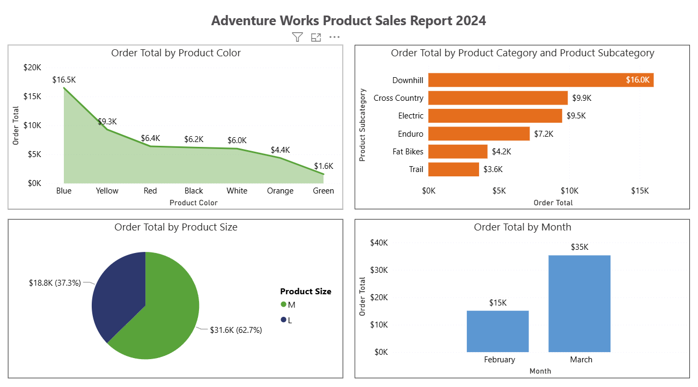
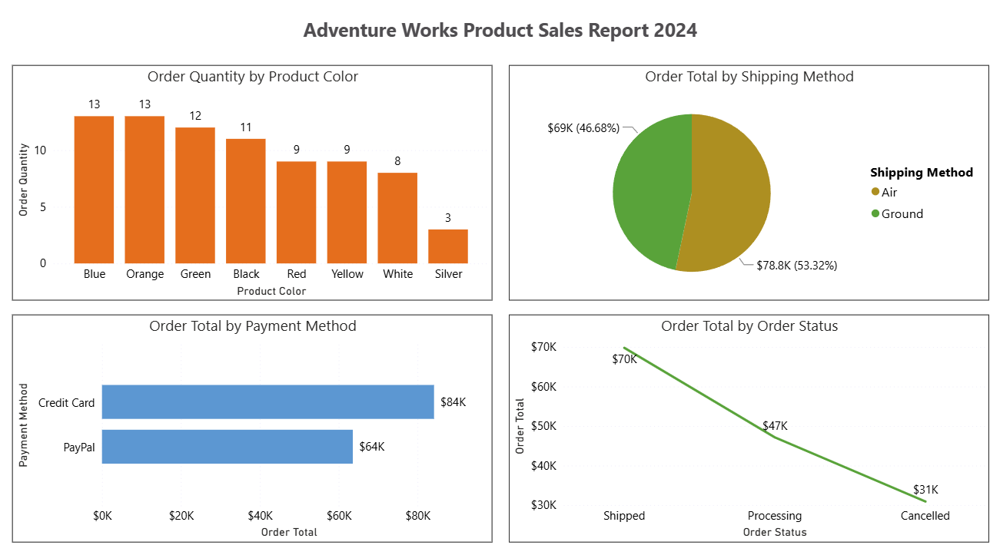

# Adventure Works Product Sales Report 2024 (Power BI)

Power BI report analysing Adventure Works product sales (2024) using a star-style data model, basic DAX measures, and interactive visuals.

## What this project does
This report helps explore **Order Total** and **Order Quantity** across:
- Product attributes (category, subcategory, colour, size)
- Region
- Shipping method
- Payment method
- Order status

## Data modelling (high level)
Built a simple model from a flat CSV by creating dimension tables and relating them to a sales fact table:
- **Products** (dimension)
- **Regions** (dimension)
- **Customer Segments** (dimension)
- **Sales / Orders** (fact)

### Customer segmentation rule
Derived customer segments using order behaviour:
- **Order Quantity = 1 → Individual Customers**
- **Order Quantity > 1 → Retail Stores**

## Report pages
### Page 1

### Page 2

## Files
- PBIX report: [`pbix/Sales-Report.pbix`](pbix/Sales-Report.pbix)

## Skills demonstrated
- Power Query: shaping data, creating dimension tables
- Data modelling: relationships (1:*), clean field organisation
- DAX: measures for totals/aggregation
- Visual design: interactive charts, comparisons, and summaries

## Demo video
- I will add my screen recording link here soon 

## Notes
Built as part of a Coursera/Microsoft Power BI learning project using a provided sample dataset.
